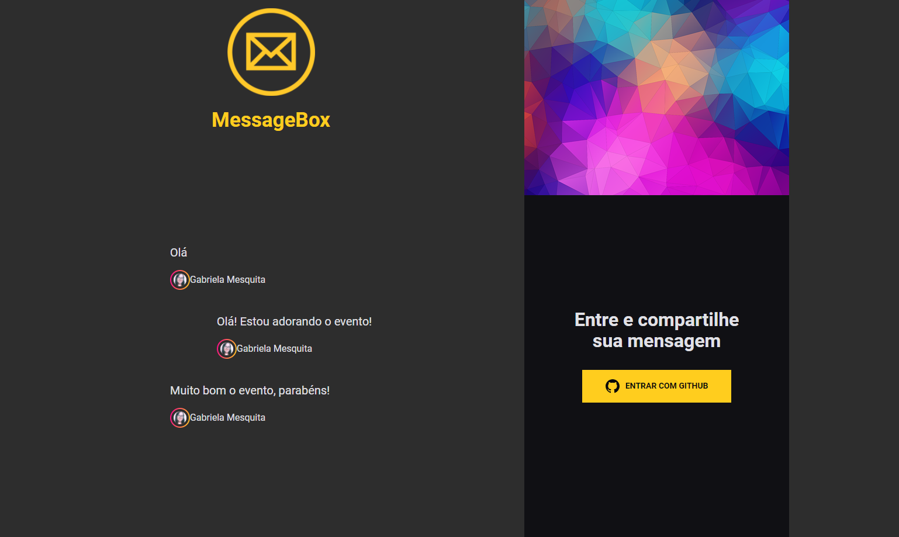
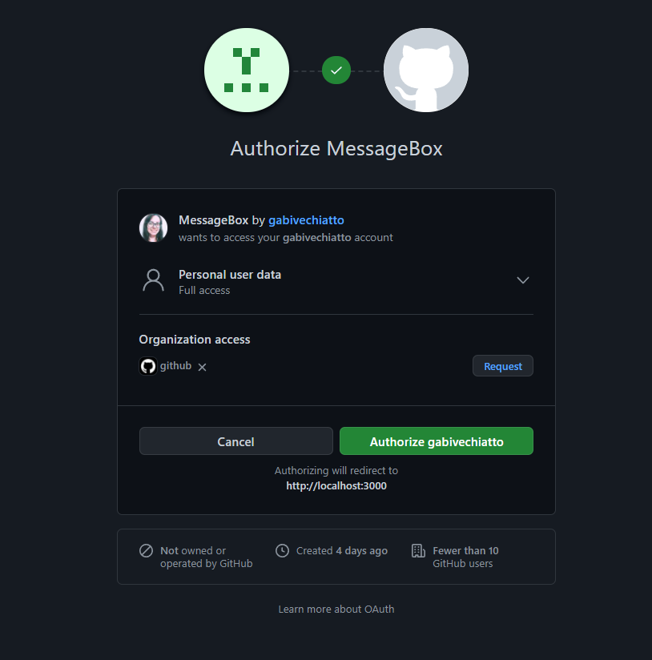
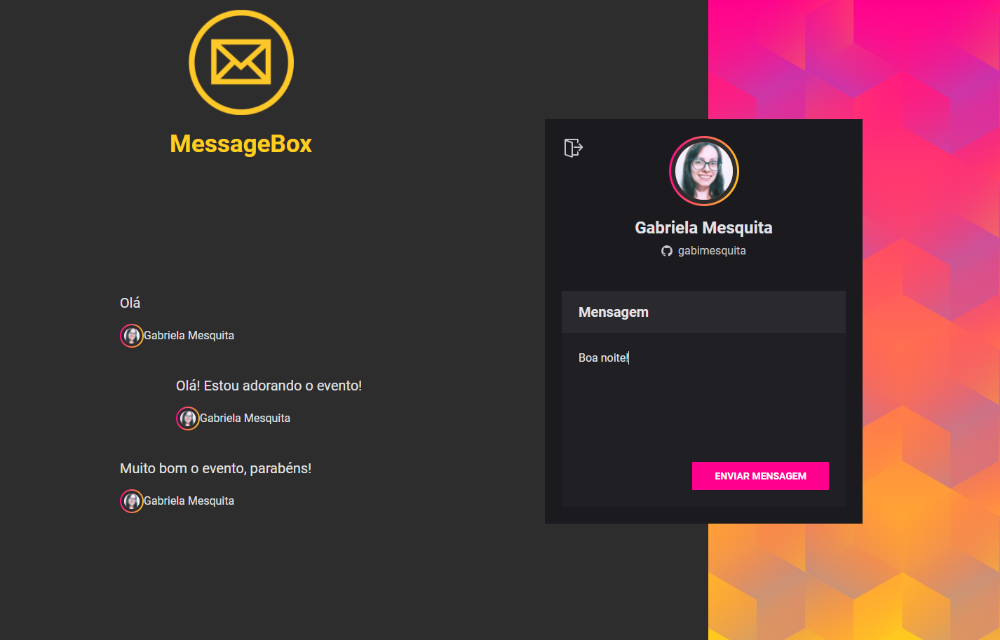

# MessageBox

<p>Projeto de envio de mensagens para eventos on-line (front e back)</p>

<p>Tecnologias utilizadas: React, Vite, Prisma, Yarn. </p>
 
## Como usar? ##
 
 <div align="center">
  
  
  
 </div>

  &#xa0;


</div>

<p align="center">
  <a href="#dart-sobre">Sobre</a> &#xa0; | &#xa0;   
  <a href="#rocket-tecnologias">Tecnologias</a> &#xa0; | &#xa0;
  <a href="#white_check_mark-pré-requesitos">Pré-requisitos</a> &#xa0; | &#xa0;
  <a href="#checkered_flag-começando">Iniciando</a> &#xa0; | &#xa0;
  <a href="#memo-licença">Licença</a> &#xa0; | &#xa0;
</p>

<br>

## :dart: Sobre ##

MessageBox é uma aplicação para mostrar envio de mensagens em eventos on-line, com autenticação através de oauth do GitHub.

## :rocket: Tecnologias ##

As seguintes ferramentas foram usadas na construção do projeto:

- [React](https://pt-br.reactjs.org/)
- [Vite](https://vitejs.dev/)
- [Prisma](https://www.prisma.io/)
- [Yarn](https://yarnpkg.com/)

## :white_check_mark: Pré-requisitos ##

Antes de começar :checkered_flag:, você precisa ter o [Git](https://git-scm.com) e o [Node](https://nodejs.org/en/) instalados no PC!

## :checkered_flag: Iniciando ##

```bash
# Clone este repositório
$ git clone https://github.com/gabimesquita/App_IMC_React_Native

# Entre na pasta
$ cd front-end e na pasta raíz

# Instale as dependências
$ yarn

# Para iniciar o projeto
$ yarn dev

# O front vai inicializar em <http://localhost:3000> e o back em <http://localhost:4000>
```

## :memo: Licença ##

Este projeto está sob licença MIT. Veja o arquivo [LICENSE](license.md) para mais detalhes.


&#xa0;

<a href="#top">Voltar para o topo</a>


